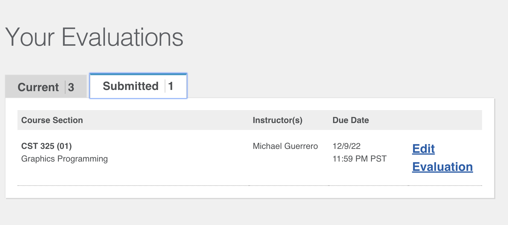

1. my favorite project in this course was probably shadow mapping because it was so cool to make something that I can really really interact with. super cool to see my shadow move with the light and be able to control it

2.
 
